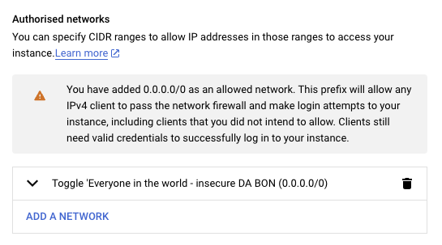
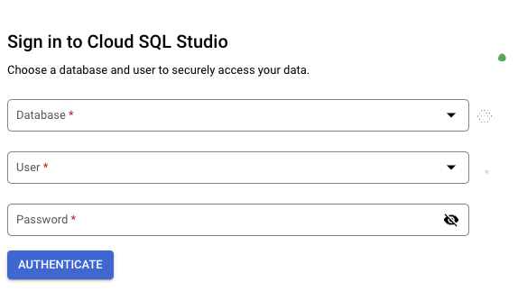
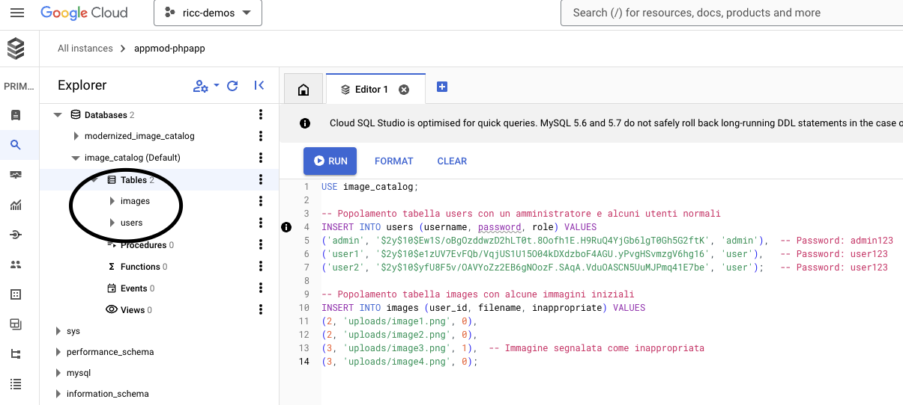

We need a place where to store the Database in the Cloud. This might take some time, so be prepared to work in parallel.

## Create a SQL Instance (⏳ will take ~10min)

1. Make sure you have billing enabled for your project, or you won't be able to create an instance.
2. Go to Cloud SQL page: https://console.cloud.google.com/sql/instances
3. Click "Create Instance"
4. Choose MySQL.
5. Get the cheapest:
    * Edition: `Enterprise`
    * Preset: `development`
    * Mysql Ver: `5.7` (wow, a blast from the past!)
6. Instance id: `appmod-phpapp`
7. Password: whatever you want but note it down as `CLOUDSQL_INSTANCE_PASSWORD` (possibly save it in your `.env`).
8. Region: keep the same as you've chose for the rest of the app (eg, Milan = `europe-west-8`)
9. Zonal avail: `Single Zone` (we're saving money for the demo).
10. Additional notes: You might want to disable the flag `Enable deletion protection` since you're just playing with this.

**Note**: sometimes changing a value could auto-change other values..

## ⏳ Wait for the Instance to be created.. #attendereprego

This might take 10min or so.

Time to get a ☕️ coffee, or move to some other pallalel task.

## Create a DB, user and password

**Create the DB**

* Open your instance and Click on **Databases** tab:
* You should be here: https://console.cloud.google.com/sql/instances/appmod-phpapp/databases
* click "Create Database"
* call it `image_catalog` (as in the PHP app config).

**Create User(s)**

* Now click on `Users` tab: https://console.cloud.google.com/sql/instances/appmod-phpapp/users
* Click "Add user account".
* User: lets create one:
    * Username: `appmod-phpapp-user`
    * Password: Choose something STRONG, click `GENERATE`.
    * Keep "Allow any host (%)".
* click ADD.

## Open the DB to well-known IPs.

Note all DBs in Cloud SQL are born 'isolated'. You need to explicitly set up a network to be accessible *from*.

* Click on your instance
* Click on thr "Networking" tab. You should somewhere near this link: https://console.cloud.google.com/sql/instances/appmod-phpapp/connections/networking
* Click under `Authorised networks`. Now add a subnet. If you a
    * If you're lazy and want it to work INSECURELY but right now, do this:
        * Name: `Everyone in the world - INSECURE` (yes I like to put insecure in the name).
        * Network: `0.0.0.0/0` (Note: this is **INSECURE**!)
    * If you want it to be more secure:
        * Find your IP address (eg on https://whatismyipaddress.com/ ), say `77.109.152.98` (my flat in Zurich)
        * Name: "Riccardo personal IP from Home" (or whichever descriptive label you want)
        * Network: `77.109.152.98/0`.
        * It might make sense to do this 5 minutes after ensuring that the `everyone` works: so many moving parts!

* Click **save**.

You should see something like this:



## Time to test DB connection!

First test DB, User and Password from the Console.



1. Open the Studio tab from your Cloud SQL instance page: https://console.cloud.google.com/sql/instances/appmod-phpapp/studio
1. Populate Database and User.
1. Paste your password from `.env`.


### (experts only)

Now time to test it from your laptop!

**Note**: this will only work if you created the instance, the DB, user, password and you opened the network.
Test the DB connection, with localhost command:

```
# Manual
$ mysql -u USER -pPASSWORD DATABASE -h HOST
# Assisted
./check-mysql.sh
```

If this doesn't work, check everything done so far!

A **BUG** on my Mac: **ERROR 2059 (HY000): Authentication plugin 'mysql_native_password' cannot be loaded:** was solved
by [this link](https://github.com/Homebrew/homebrew-core/issues/180498) and lazily backporting to MySQL 8.4. Not ideal, but it worked. Actually [This comment](https://github.com/Homebrew/homebrew-core/issues/180498#issuecomment-2296006936) worked.

## Import the Database from codebase

Two ways to do it: the UI way (simple) and the CLI way (more control):

### UI way

1. Open https://console.cloud.google.com/sql/instances/appmod-phpapp/studio
1. Put DB, user and password.
1. Go your PHP app's code and copy the `db/01_schema.sql` here. Note the `CREATE DATABASE image_catalog;` will fail so you either comment it or change it to `CREATE DATABASE IF NOT EXISTS image_catalog;`
1. Copy also the `db/02_seed.sql`.
1. you should see two nice tables on the left now:



### CLI way (experts only)

Something like this should do:

```bash
cat db/01_schema.sql db/02_seed.sql | mysql -u USER -pPASSWORD DATABASE -h HOST # substitute vars appropriately
```

## Notes on more secure connections

You are currently using a public IP to connect to the Cloud SQL instanece, with additional security of a L3 firewall.

Is this the best way to do it? Is it the only way to do it? Probably no.

There are many other options you might want to check out: https://cloud.google.com/sql/docs/mysql/connect-overview

More information on hardening the DB are in the chapter 07.

