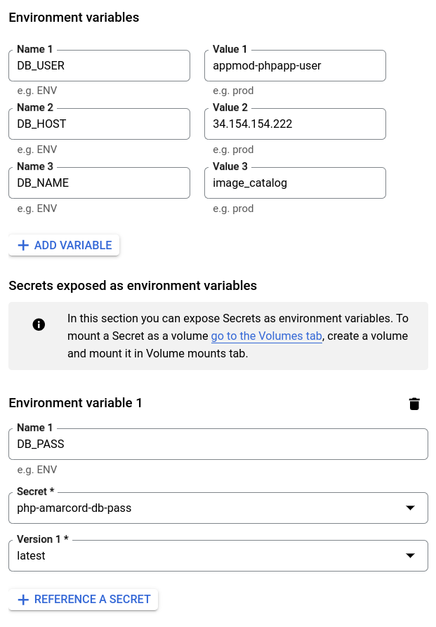

Preparing an app for the cloud is all about extracting pieces of info from the app to the outside world,
and this is normally done (as a first step) with `ENV` variables. this allows you to deploy similar versions
of the same app to different endpoints, with slightly different configurations.

Let's see4 this with some examples.

## Respect the Environment (TODO(ricc) integra meglio con il 2.5)

It all starts with `ENV`.

ENV is the "**bridge**" between your deployed app and your system to provide those variables.

Example:

From:

```
$db_host = 'localhost'; // or https://1.2.3.4/
$db_name = 'my_awesome_db';
$db_user = 'my_secret_user';
$db_user = 'nonL4Indovin3r4iM41';
```

to:

```php
# TODO(ricc):  obsoleto - vedi 2.5
$db_host = getenv('DB_HOST');
$db_name = getenv('DB_NAME');
$db_user = getenv('DB_USER');
$db_user = getenv('DB_PASS');
```


## Let's get to work!


**1. Create the `.env` file**  TODO(ricc): sposta allo step `00-fork`

Get inspired by local .env.dist and copy it locally.
I made it so you can't easily add to git mistakenly.


## Even better

What about using Secret Manager?

Maybe the secretest of your secrets (in proper English, "deep secrets") can't stand on ENV, you're afraid someone could
steal it. So let's do better. Let's make sure this NEVER makes it anywhere else than Secret Manager.

```
$db_host = getenv('DB_HOST'); // from ENV
$db_name = getenv('DB_NAME'); // from ENV
$db_user = getenv('DB_USER'); // from ENV
$db_user = getenv('DB_PASS'); // Stored and linked to Secret Manager
```

## Secret Manager

* Click on [Secret Manager](https://console.cloud.google.com/security/secret-manager). First time you will be asked to enable the API:

* Now click "Create a secret": Let's call it rationally
   * Name: `php-amarcord-db-pass`
   * Secret value: '*your DB password*' (ignore the "upload file" part).
* annotate this secret link, should look like `projects/839850161816/secrets/php-amarcord-db-pass`. This is the univoque pointer to your secret (For Terraform, Cloud Run, and others).
* Now we need to tell Cloud run how to get this information:
* Finally, clean up your code and remove every essence of DB_PASS. Your code is now clean!


## Per i modenesi

Ragazzi fatemi un piacere. provate a SALTARE la parte di CLONAGGIO. Mi sembra che l'autodetected passi aTUOMATICAMENTE al cloudbuild.yaml quando lo trova.
Provate a seguire i passi di sotto, ma SENZA creare un secondo trigger
eidtemi se il primo magicamente funge.

## YAML YAML guaglio' (tm)

Let's try to do the same with a more prescriptive multi-stage home-written Cloud Build `YAML` file.

* Copy the previous script, since most stuff will be the same as your first script: Click the 3 dots, then "Duplicate"



* Rename `on-git-commit-build-php-app-1` to `on-git-commit-build-php-app-cbyaml`
* Click EDIT
* Configuration: change from "autodetected" to "Cloud Build configuration file (YAML or JSON)"
* Create or copy from here the `cloudbuild.yaml`
    * TODO ricc quando funge mettilo qui.
    * WIP - for now its here.: `git@github.com:Friends-of-Ricc/app-mod-workshop.git`
* Add variables (note you need to prepend them with a "_"):
     * `_APP_NAME`: something mnemonic about your PHP app
     * `_DB_NAME`: Your ENV `DB_NAME`
     * `_DB_USER`: Your ENV `DB_USER`
     * `_DB_HOST`: Your ENV `DB_HOST`
     * What about `DB_PASS`? Great question! You don't need her. She's in the beautiful and secure realm of Secret Manager! By the end of this exercise, you'll wish you'd moved everything to SM!

* When you've created the trigger, NOw it's time to add the `cloudbuild.yaml` to your code base. If it breaks, no biggie, it never works on first try!
    * If you committed before creating the build trigger, no problem. In this case, go to the https://console.cloud.google.com/cloud-build/triggers page and hit "Run" in the newly created `on-git-commit-build-php-app-cbyaml`.

### Troubleshoot

Usually it takes a while to get CB to work. You need tolearn to check logs and refine the script. Usually the docker complains about a missing ENV or Cloud Run won't start from some reason.

* Between Cloud Run logs and Cloud build logs, you should be able to iterate and fix it.
* this might mean doing micro-commits with a one-line change in `cloudbuild.yaml` , git commit, git push, and observe the changes.
* Yes, this can be frustrating, but it's the price to set up a CI/CD!

**Artifact Repository**

You might have noticed there's a missing piece here: we did NOT create the Docker-type Artifact Repository, leveraging the existing one created by cloud run for us and called `cloud-run-source-deploy`. This is alike cheating - we shortened this course by re-using an existing one. If for some reason you don't have an existing AR called "cloud-run-source-deploy" in your favorite `GCP_REGION`, chances are the build will fail. In that case, make sure to create one:

* Go to

## RICC rimuyovimi quando funge

TODO(Ricc): finisci sta parte e trova la riga da metter su cloud run tipo:

* TOGLI --env DB PASS
* METTI --env-ecret sobenme secrets/php-amarcord-db-pass
