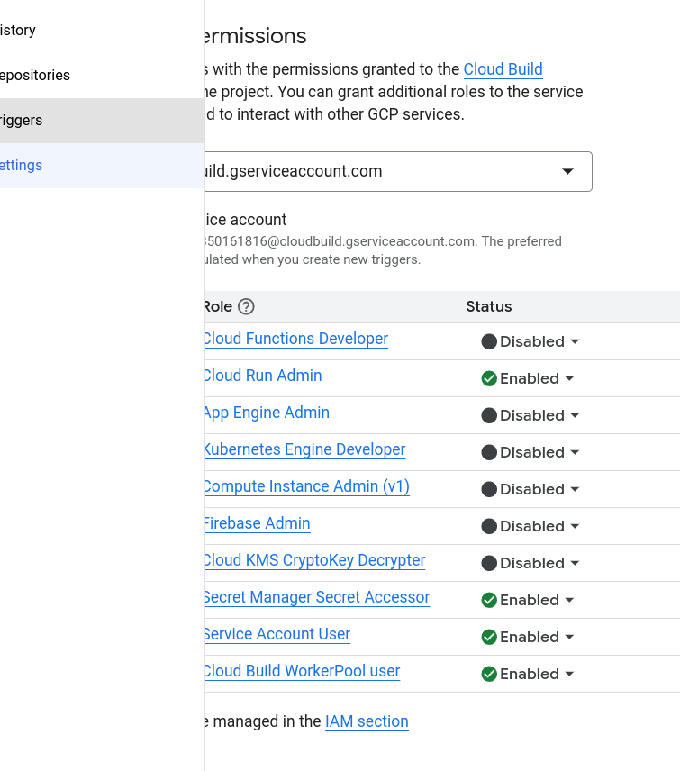

## Why a CI/CD Pipelinet?

By now, you should have typed `gcloud run deploy` a few times, maybe answering the same question over and over again.

Wouldn't it be nice if we could trigger a new build every time you do a new commit/push to your own git repo? To do this we need two things:

1. A personal git repo (luckily, you can fork the )
2. [Cloud Build](https://cloud.google.com/build?hl=en). This amazing and [cheap](https://cloud.google.com/build#pricing) service allows you to configure build automations for pretty much everything: Terraform, dockerized apps, ..

In step 00 you should have already done the part (1) - if not please go back and make sure you have a fork of the repo in this form: https://github.com/<YOUR_GITHUB_USER>/app-mod-workshop.

Here we'll concentrate on part (2) .

## Enter Cloud Build!

We will use Cloud Build to do this:

* build your source (with Dockerfile or BuildPacks). Think of this as a "big .zip file".
* push this "big zip" to Artifact Registry (AR).
* Then issue a deployment from AR to Cloud Run for app "php-amarcord"
    * This will create a new *version* on the existing app (think of a layer with the new code) and we will configure it to divert the traffic to the new version if the push succeeds.

This is an example of some builds for my `php-amarcord` app:

how do we do all of this? By crafting one perfect YAML file: `cloudbuild.yaml`

