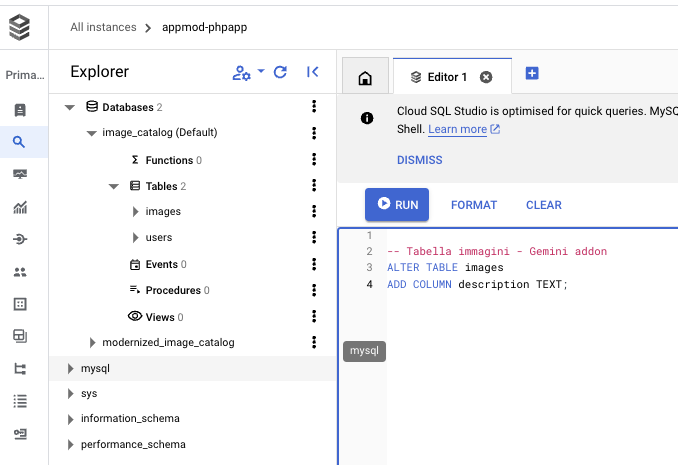

## Prerequisites

In the previous chapter, a model solution allowed us to mount images `/uploads/` on GCS, *de facto* separating the App logic from the image storage.

This exercise requires you to:

* Have successfully completed excericse in chapter 6 (storage).
* Have a GCS bucket with the image uploads, where people upload pictures on your app and pictures flow to your bucket.

## Set up a Cloud function (in python)

Have you ever wondered how to implement an **event-driven application**? Something like:

* when \<event\> happens => send an email
* when \<event\> happens => if this is true, then update the Database.

Event can be anything, from new record available in BigQuery, a new object changed in a folder in GCS, or a new message is waiting in a queue in Pub/Sub.

Google Cloud supports multiple paradigms to achieve this. Most notably:

* [EventArc](https://cloud.google.com/eventarc/docs). See how to [receive GCS events](https://cloud.google.com/eventarc/docs/run/create-trigger-storage-gcloud). Great to create DAGs and orchestrate actions based on if-then-else in the CLoud.
* [Cloud Scheduler](https://cloud.google.com/scheduler/docs/). Great for a midnight cron job in the Cloud, for instance.
* [Cloud Workflows](https://cloud.google.com/workflows). Similarly to Event Arc, allows you to
* **[Cloud Run Functions](https://cloud.google.com/functions)** (familiarly known as `lambdas`).
* [Cloud Composer](https://cloud.google.com/composer/docs/concepts/overview). Basically Google version of [Apache Airflow](https://airflow.apache.org/), also great for [DAG](https://en.wikipedia.org/wiki/Directed_acyclic_graph)s.

In this exercise, we'll delve into Cloud Function to achieve a quite spectacular result. And we will provide an optional add-on for you.

## Set up a Cloud function (🐍 python)

We are trying to create a very ambitious GCF.

1. **When a new image is created on GCS..** (probably as someone has uploaded it on the app - but not only)
1. **.. call Gemini to describe it and get a textual description of the image ..** (would be nice to check the MIME and ensure its an image and not a PDF, MP3, or Text)
1. **.. and update the DB with this description.** (this might require patching the DB to add a `description` column to the `images` table).


## Patch the DB to add `description` to images

1. Open Cloud SQL Studio:


2. Put your user and password for the Images DB
3. Inject this SQL which adds a column for an image descripton:

```sql
-- Images table - Adding a description textual field for Gemini to populate it
ALTER TABLE images
ADD COLUMN description TEXT;
```



And bingo! Try now to check if it worked:

```sql
SELECT * FROM images;
```

You should see the new description column:


## Write the Gemini GCF

**Note**. I've actually asked Gemini to write it for me, then I changed a few things.

You can either create the GCF from UI or from command line. I'll use the command line here.

A possible code can be found under `.solutions`

1. Create a `requirements.txt` file:

```
#requirements.txt
google-cloud-storage
google-cloud-aiplatform
pymysql
```

2. Create a python function. Sample code here: [gcf/main.py](https://github.com/Friends-of-Ricc/app-mod-workshop/blob/main/gcf/main.py).

```python

from google.cloud import storage
from google.cloud import aiplatform
import vertexai
from vertexai.generative_models import GenerativeModel, Part
import os
import pymysql
import pymysql.cursors

# Replace with your project ID
PROJECT_ID = "your-project-id"
GEMINI_MODEL = "gemini-1.5-pro-002"
DEFAULT_PROMPT = "Generate a caption for this image: "

def gemini_describe_image_from_gcs(gcs_url, image_prompt=DEFAULT_PROMPT):
    pass

def update_db_with_description(image_filename, caption, db_user, db_pass, db_host, db_name):
    pass

def generate_caption(event, context):
    """
    Cloud Function triggered by a GCS event.
    Args:
        event (dict): The dictionary with data specific to this type of event.
        context (google.cloud.functions.Context): The context parameter contains
                                                event metadata such as event ID
                                                and timestamp.
    """
    pass
```

3. Push the function. You can use a script similar to this: [gcf/push-to-gcf.sh](https://github.com/Friends-of-Ricc/app-mod-workshop/blob/main/gcf/push-to-gcf.sh).

**Note 1**. Make sure to source the ENVs with the right values, or just add them on top (`GS_BUCKET=blah`, ..):

**Note 2**. This will push all the local code (`.`) so make sure to surround your code in a specific folder and to use `.gcloudignore` like a pro to avoid pushing huge libraries. ([example](https://github.com/Friends-of-Ricc/app-mod-workshop/blob/main/gcf/.gcloudignore)).

```bash
#!/bin/bash

set -euo pipefail

echo Sourcing .env..
# source ../.env ||  fatal 2

.  ~/git/app-mod-workshop-set-by-step/.env

echo "Pushing ☁️ f(x)☁ to 🪣 $GS_BUCKET, along with DB config.. (DB_PASS=$DB_PASS)"

echodo gcloud --project "$PROJECT_ID" functions deploy php_amarcord_generate_caption \
    --runtime python310 \
    --region "$GCP_REGION" \
    --trigger-event google.cloud.storage.object.v1.finalized \
    --trigger-resource "$BUCKET" \
    --set-env-vars "DB_HOST=$DB_HOST,DB_NAME=$DB_NAME,DB_PASS=$DB_PASS,DB_USER=$DB_USER" \
    --source . \
    --entry-point generate_caption \
    --gen2
```
## Testing the function

The function has many moving parts. You might want to be able to test all the single ones.

An example is in [gcf/test.py](https://github.com/Friends-of-Ricc/app-mod-workshop/blob/main/gcf/test.py).


## Conclusions

You got a Cloud Function triggered on new objects landing on GCS which is able to annotate the content of the image like a human could do, and auttomatically update the DB. Wow!

What's next? You could follow the same reasoning to achieve two great functionalities.

### [optional] Add further Cloud Functions [open ended]

1. An email trigger which sends you an email every time someone sends a picture. Or a BIG picture. Or a picture whose content contains "nude/nudity".

1. Currently a human admin is flagging images for "inappropriate". How about having Gemini doing the heavy lifting? Add a test to flag inappropriate trigger content and update the DB as we learnt in the previous function. This means basically taking the previous function, changing the prompt, and updating the DB based on the answer. The only caveat is: make sure the "creative output" from Gemini is put on rails. You might ask a deterministic answer like a confidence score from 0 to 1, a JSON, .. You can achieve this in many ways, for example:
    * Using python libraries `pydantic`, `langchain`, ..
    * Use [Gemini Structured Output](https://ai.google.dev/gemini-api/docs/structured-output).


# Possible errors

The first I've developed this solution I came onto some IAM permission issues. I will add them here for empathy and to give some ideas on how to fix them.


