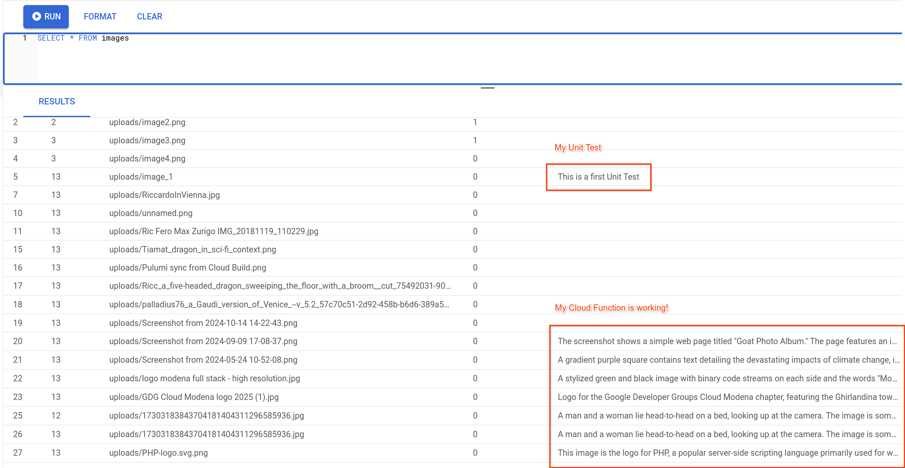
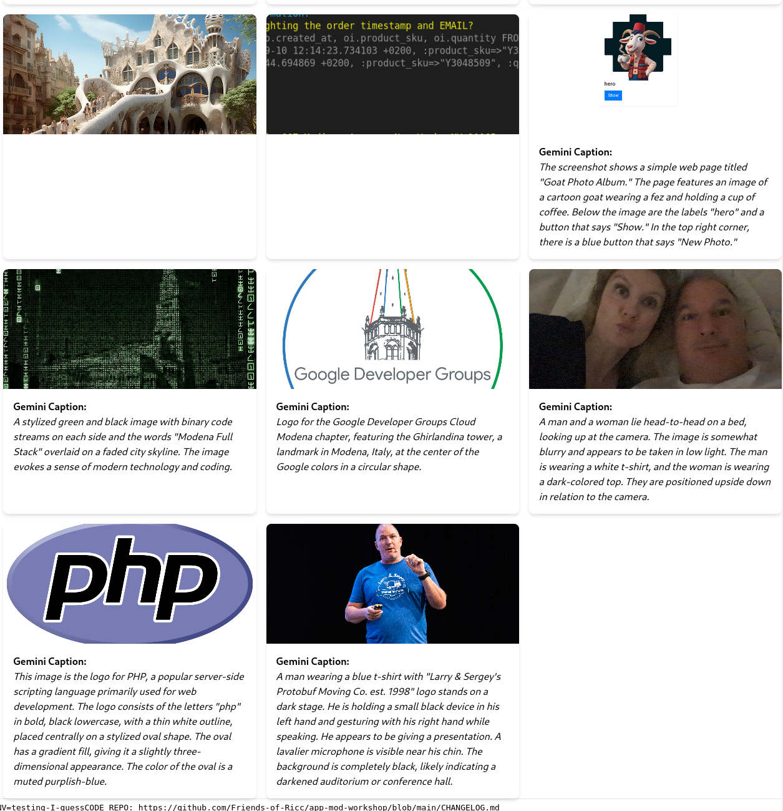

Now you have an awesome modernized, shiny new PHP app (like a 2024 `Fiat 126`) with Cloudified storage.

What can you do with it?

## Prerequisites

In the previous chapter, a model solution allowed us to mount images `/uploads/` on GCS, *de facto* separating the App logic from the image storage.

This exercise requires you to:

* Have successfully completed exercise in chapter 6 (storage).
* Have a GCS bucket with the image uploads, where people upload pictures on your app and pictures flow to your bucket.

## Set up a Cloud function (in python)

**Note**. This function can be written in ANY language you want! Please do write in in your favorite language. We provide a solution in python because it's widely utilized. Please file a PR or reach out to the author with a PR or link to your solution. I really mean it. I'm working on getting a little prize for good contributors.

Have you ever wondered how to implement an **event-driven application**? Something like:

* when \<event\> happens => send an email
* when \<event\> happens => if this is true, then update the Database.

Event can be anything, from new record available in BigQuery, a new object changed in a folder in GCS, or a new message is waiting in a queue in Pub/Sub.

Google Cloud supports multiple paradigms to achieve this. Most notably:

* [EventArc](https://cloud.google.com/eventarc/docs). See how to [receive GCS events](https://cloud.google.com/eventarc/docs/run/create-trigger-storage-gcloud). Great to create DAGs and orchestrate actions based on if-then-else in the CLoud.
* [Cloud Scheduler](https://cloud.google.com/scheduler/docs/). Great for a midnight cron job in the Cloud, for instance.
* [Cloud Workflows](https://cloud.google.com/workflows). Similarly to Event Arc, allows you to
* **[Cloud Run Functions](https://cloud.google.com/functions)** (familiarly known as `lambdas`).
* [Cloud Composer](https://cloud.google.com/composer/docs/concepts/overview). Basically Google version of [Apache Airflow](https://airflow.apache.org/), also great for [DAG](https://en.wikipedia.org/wiki/Directed_acyclic_graph)s.

In this exercise, we'll delve into Cloud Function to achieve a quite spectacular result. And we will provide optional exercises for you.

Note that sample code is provided under `.solutions/`.

## Set up a Cloud function (🐍 python)

We are trying to create a very ambitious GCF.

1. **When a new image is created on GCS..** (probably as someone has uploaded it on the app - but not only)
1. **.. call Gemini to describe it and get a textual description of the image ..** (would be nice to check the MIME and ensure its an image and not a PDF, MP3, or Text)
1. **.. and update the DB with this description.** (this might require patching the DB to add a `description` column to the `images` table).


## Patch the DB to add `description` to images

1. Open Cloud SQL Studio:


2. Put your user and password for the Images DB
3. Inject this SQL which adds a column for an image descripton:

```sql
-- Images table - Adding a description textual field for Gemini to populate it
ALTER TABLE images
ADD COLUMN description TEXT;
```


And bingo! Try now to check if it worked:

```sql
SELECT * FROM images;
```

You should see the new description column:


## Write the Gemini GCF

**Note**. I've actually asked Gemini to write it for me, then I changed a few things.

You can either create the GCF from UI or from command line. I'll use the command line here.

A possible code can be found under `.solutions`

1. Create a `requirements.txt` file:

```
#requirements.txt
google-cloud-storage
google-cloud-aiplatform
pymysql
```

2. Create a python function. Sample code here: [gcf/main.py](https://github.com/Friends-of-Ricc/app-mod-workshop/blob/main/gcf/main.py).

```python

from google.cloud import storage
from google.cloud import aiplatform
import vertexai
from vertexai.generative_models import GenerativeModel, Part
import os
import pymysql
import pymysql.cursors

# Replace with your project ID
PROJECT_ID = "your-project-id"
GEMINI_MODEL = "gemini-1.5-pro-002"
DEFAULT_PROMPT = "Generate a caption for this image: "

def gemini_describe_image_from_gcs(gcs_url, image_prompt=DEFAULT_PROMPT):
    pass

def update_db_with_description(image_filename, caption, db_user, db_pass, db_host, db_name):
    pass

def generate_caption(event, context):
    """
    Cloud Function triggered by a GCS event.
    Args:
        event (dict): The dictionary with data specific to this type of event.
        context (google.cloud.functions.Context): The context parameter contains
                                                event metadata such as event ID
                                                and timestamp.
    """
    pass
```

3. Push the function. You can use a script similar to this: [gcf/push-to-gcf.sh](https://github.com/Friends-of-Ricc/app-mod-workshop/blob/main/gcf/push-to-gcf.sh).

**Note 1**. Make sure to source the ENVs with the right values, or just add them on top (`GS_BUCKET=blah`, ..):

**Note 2**. This will push all the local code (`.`) so make sure to surround your code in a specific folder and to use `.gcloudignore` like a pro to avoid pushing huge libraries. ([example](https://github.com/Friends-of-Ricc/app-mod-workshop/blob/main/gcf/.gcloudignore)).

```bash
#!/bin/bash

set -euo pipefail

echo Sourcing .env..
# source ../.env || exit 2

.  ~/git/app-mod-workshop-set-by-step/.env

echo "Pushing ☁️ f(x)☁ to 🪣 $GS_BUCKET, along with DB config.. (DB_PASS=$DB_PASS)"

echodo gcloud --project "$PROJECT_ID" functions deploy php_amarcord_generate_caption \
    --runtime python310 \
    --region "$GCP_REGION" \
    --trigger-event google.cloud.storage.object.v1.finalized \
    --trigger-resource "$BUCKET" \
    --set-env-vars "DB_HOST=$DB_HOST,DB_NAME=$DB_NAME,DB_PASS=$DB_PASS,DB_USER=$DB_USER" \
    --source . \
    --entry-point generate_caption \
    --gen2
```
## Testing the function

### Unit Tests

The function has many moving parts. You might want to be able to test all the single ones.

An example is in [gcf/test.py](https://github.com/Friends-of-Ricc/app-mod-workshop/blob/main/gcf/test.py).

### Cloud Functions UI

Also take some time to explore your function on the UI. Every tab is worth exploring, particularly the `Source` (my favourite), `Variables`, `Trigger`, and `Logs`; You'll spend a lot of time in the `Logs` to troubleshoots errors (also see possible errors on the bottom of this page). also make sure to check `Permissions`.


### E2E Test

Time to manually test the function!

1. Go to your app, and login
2. Upload a picture (not too big, we've seen issues with big images)
3. check on UI the picture is uploaded.
4. Check on **Cloud SQL Studio** that the description has been updated. Login and run this query: `SELECT * FROM images`.



And it works! We might also want to update the frontend to show that description.

## Update PHP to show [optional]

We have proven the app works. However, it would be nice that the users could also see that description.

We don't need to be PHP experts to add the description to the `index.php`. This code should do (yes, Gemini wrote it for me!):

```php

    <?php if (!empty($image['description'])): ?>
        <p class="font-bold">Gemini Caption:</p>
        <p class="italic"><?php echo $image['description']; ?></p>
    <?php endif; ?>

```

In the next steps we also see a prettier UI version, thanks to Gemini Code Assist. A pretty version might look like this:



## Conclusions

You got a Cloud Function triggered on new objects landing on GCS which is able to annotate the content of the image like a human could do, and auttomatically update the DB. Wow!

What's next? You could follow the same reasoning to achieve two great functionalities.

### [optional] Add further Cloud Functions [open ended]

1. An email trigger which sends you an email every time someone sends a picture.
    * Too often? Add a further constraint: A BIG picture, or a picture whose Gemini content contains the words "nude/nudity/violent".

1. Currently a human admin is flagging images for "inappropriate". How about having Gemini doing the heavy lifting? Add a test to flag inappropriate trigger content and update the DB as we learnt in the previous function. This means basically taking the previous function, changing the prompt, and updating the DB based on the answer. The only caveat is: make sure the "creative output" from Gemini is put on rails. You might ask a deterministic answer like a confidence score from 0 to 1, a JSON, .. You can achieve this in many ways, for example:
    * Using python libraries `pydantic`, `langchain`, ..
    * Use [Gemini Structured Output](https://ai.google.dev/gemini-api/docs/structured-output).

**Tip**. You could have MULTIPLE functions or have a single prompt which enforces a JSON answer (works greta with "Gemini Structured Output"as highlighted above) like:

What would the prompt be to generate this?

```JSON
{
    "description": "This is the picture of an arrosticino",
    "suitable": TRUE
}
```

You could add in the prompt additional fields to get insights like: is there something good about it? Bad about it? Do you recognize the place? Is there some text (OCR has never been easier):

* `goods`: "It looks like yummie food"
* `bads`: "It looks like unhealthy food"
* `OCR`: "Da consumare preferibilmente prima del 10 Novembre 2024"
* `location`: "Pescara, Lungomare"

# Possible errors (mostly IAM / permissions)

The first I've developed this solution I came onto some IAM permission issues. I will add them here for empathy and to give some ideas on how to fix them.

1. Note that for deploying a GCF function which listens to a GCS bucket you need to set up proper permissions to the Service Account you are using for the job, as in figure:


You might also have to enable **EventArc APIs**.

2. Another comment from UI for GCF permissioning is this ([Cloud run Invoker role](https://cloud.google.com/run/docs/reference/iam/roles)):


3. The first time I ran it, my logs could said: "'Memory limit of 244 MiB exceeded with 270 MiB used. Consider increasing the memory limit, see https://cloud.google.com/functions/docs/configuring/memory'". Again, add RAM to your GCF. This is super easy to do in the UI. Here's a possible bump:


Alternatively, you can also fix your Cloud run deployment script to bump MEM/CPU. This takes a bit longer.
