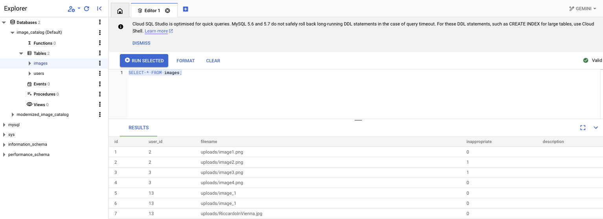

# 1. Simple Gemini PHP page [open ended]

Note: to do this exercise you need to use PHP libraries for GCP and write PHP code. Sometimes the libraries do NOT support older versions of PHP.

Libraries (they both require `composer`):
* https://cloud.google.com/php/docs/reference/cloud-ai-platform/latest (**Official Vertex AI**). `composer require google/cloud-ai-platform`
* https://github.com/gemini-api-php/client (non-supported by Google).

What to do:

* Delve into Gemini for PHP docs.
* Learn to install the library in your `Dockerfile`
* create a `gemini.php` page which calls some kind of completion of "Why PHP is still awesome in 2024?".
* test it locally until you get it to work.
* add `GEMINI_API_KEY` to SecretManager
* Deploy a new version to Cloud Run!

# Links

* [Gemini and PHP](https://github.com/gemini-api-php/client) - not sure if `composer require gemini-api-php/client` will work with PHP 5.7. Welcome to 1955, Mertin!
* [PHP library for cloud-ai-platform](https://cloud.google.com/php/docs/reference/cloud-ai-platform/latest).

## Possible troubles (IAM / permissions)

1. Note that for deploying a GCF function which listens to a GCS bucket you need to set up proper permissions to the Service Account, as in figure:

You might also have to enable **EventArc APIs**.

2. Another comment from UI for GCF permissioning is this:

3. The logs could say: "'Memory limit of 244 MiB exceeded with 270 MiB used. Consider increasing the memory limit, see https://cloud.google.com/functions/docs/configuring/memory'". Again, add RAM to your GCF.
Here's a poissible bump:

